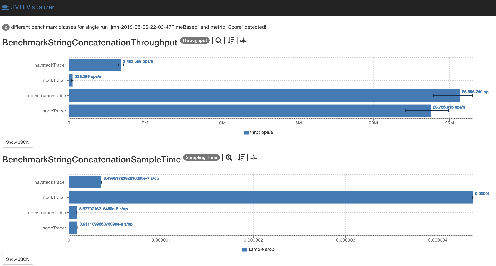
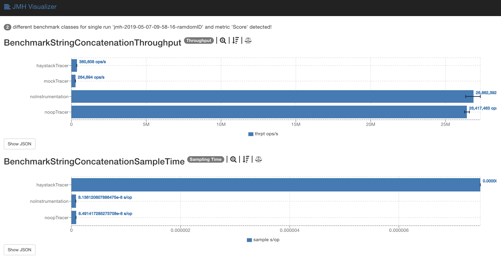
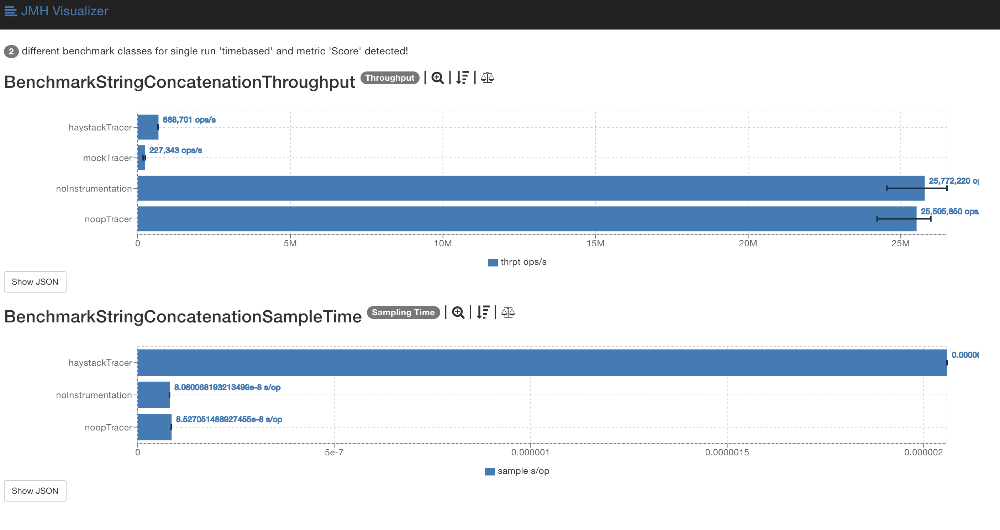

# Benchmarks


Using Long-ID Implementation


Using Random-UUID-ID Implementation


Using TimeBased-UUID-ID Implementation



## To Measure Performance of your custom ID Implementation


There are more than one way to implement the Id generator for traces and span. There are three default implementations : LongId Generator, RandomUUID Generator, TimeBasedUUID Generator. The Id Generators were implemented based on the uniqueness and performance.For eg.Long ID Generator will not be able to give uniqueness as compared to UUID implementations, while the performance of Long ID generator is better.You are free to add your own ID generator implementations.

To measure the performance of the client, you would need to clone: https://github.com/gsoria/opentracing-java-benchmark/tree/master/opentracing-benchmark-simple-java. Once this is complete, update haystack.version in pom.xml with the current version of your haystack client.
Run the following command (inside on this specific project)

```bash
mvn clean install
java -jar target/benchmarks.jar
```

Once you are done. Use [JMH-visualizer(Online version)](http://jmh.morethan.io/) to present the benchmark results.
